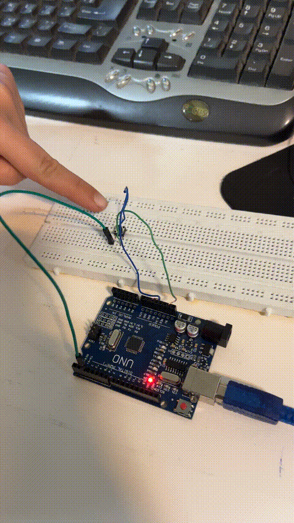
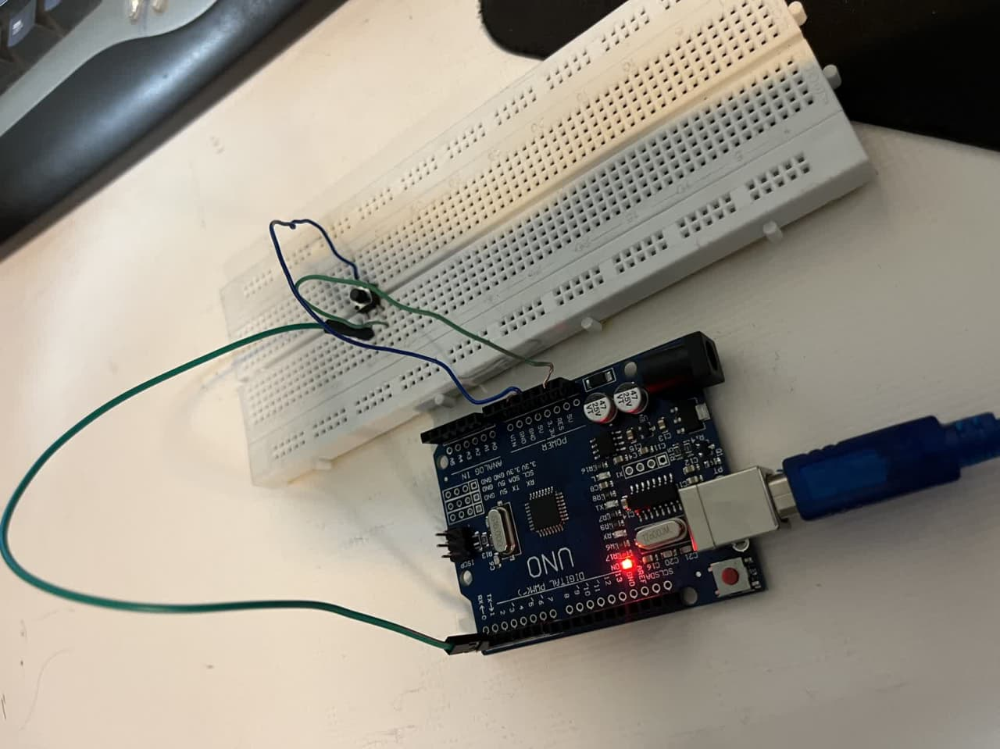

# INTERRUPT
گزارش کار آزمایش وقفه در آردوینو (Interrupt)

آزمایش:آزمایش  INTERRUPT

🎯 هدف آزمایش:

هدف از این آزمایش، آشنایی با نحوه‌ی استفاده از وقفه‌ها (Interrupts) در آردوینو و بررسی عملکرد آن‌ها در پاسخ‌گویی سریع به رویدادهای خارجی است. در این پروژه با استفاده از یک کلید فشاری و وقفه، LED داخلی آردوینو با هر بار فشار دادن کلید روشن و خاموش می‌شود و وضعیت آن از طریق پورت سریال نمایش داده می‌شود.

🧰 وسایل مورد نیاز:

•	برد آردوینو Uno یا مشابه

•	کابل USB برای اتصال آردوینو به کامپیوتر

•	کلید فشاری (Push Button)

•	بردبرد (Breadboard)

•	سیم جامپر (Jumper Wire)

•	کامپیوتر با نرم‌افزار Arduino IDE نصب‌شده

🧪 شرح آزمایش:

1.	پایه شماره 2 آردوینو به‌عنوان ورودی برای کلید فشاری در نظر گرفته شد.

2.	برای جلوگیری از نویز و اتصال شناور (floating)، از مقاومت داخلی pull-up آردوینو استفاده شد که با دستور INPUT_PULLUP فعال می‌شود.

3.	پایه‌ی 13 به‌عنوان خروجی برای LED داخلی آردوینو تنظیم شد.

4.	در برنامه، از تابع attachInterrupt() استفاده شد تا هنگام تغییر وضعیت پایه‌ی شماره 2 (از LOW به HIGH یا بالعکس)، وقفه‌ای فعال شود و تابع blink() اجرا گردد.

5.	درون تابع وقفه، وضعیت یک متغیر به نام state برعکس می‌شود و در حلقه‌ی اصلی (loop)، این مقدار برای کنترل روشن/خاموش شدن LED استفاده می‌شود.

6.	همچنین با هر بار فعال شدن وقفه، یک پیام حاوی وضعیت جدید LED از طریق Serial.println() در سریال مانیتور چاپ می‌شود.

