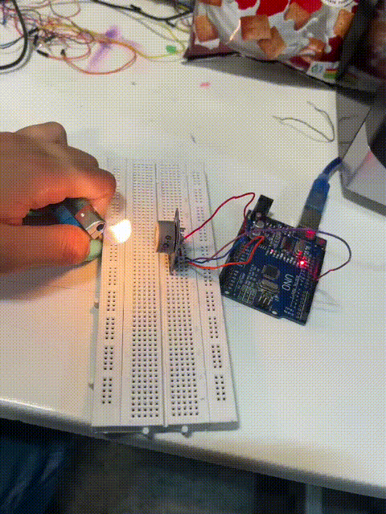

# MQ-9

 آزمایش سنسور گاز MQ-9

هدف آزمایش:

هدف از این آزمایش آشنایی با عملکرد سنسور گاز MQ-9 و نحوه‌ی خواندن مقدار ولتاژ خروجی آن از طریق پین آنالوگ آردوینو است. همچنین در این آزمایش قصد داریم ولتاژ متناظر با غلظت گازهای قابل اشتعال مانند CO و گاز شهری را محاسبه کرده و از طریق پورت سریال نمایش دهیم. این ولتاژ پایه‌ای برای کالیبراسیون‌های بعدی و تبدیل آن به ppm (مقدار گاز در میلیون قسمت هوا) خواهد بود.

شرح آزمایش:

در این آزمایش، سنسور MQ-9 به پین آنالوگ A0 آردوینو متصل می‌شود. سنسور خروجی آنالوگی دارد که متناسب با غلظت گازهای مختلف تغییر می‌کند. در کد مربوطه ابتدا داده‌ی آنالوگ از پین A0 خوانده شده و سپس به ولتاژ تبدیل می‌شود. این ولتاژ با تقسیم مقدار خوانده‌شده بر 1024 و ضرب در 5 ولت (ولتاژ مرجع آردوینو) به دست می‌آید. مقادیر ولتاژ خروجی به صورت پیوسته از طریق مانیتور سریال نمایش داده می‌شود تا کاربر بتواند تغییرات آن را در شرایط مختلف مشاهده کند.

وسایل مورد نیاز:

 • یک عدد سنسور گاز MQ-9
 
 • یک عدد برد آردوینو (ترجیحاً Uno)
 
 • سیم جامپر برای اتصال‌ها
 
 • کابل USB برای اتصال آردوینو به کامپیوتر
 
 • نرم‌افزار Arduino IDE
 
 • منبع گاز (مثلاً روشن کردن فندک یا نزدیک کردن گاز شهری برای مشاهده تغییر در خروجی)
