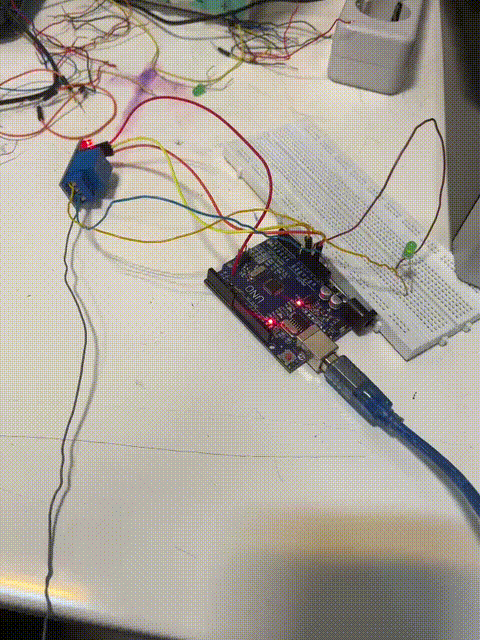
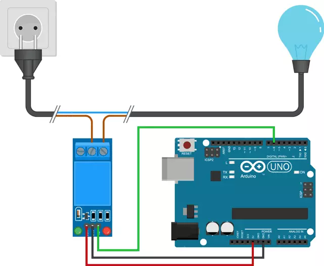

# RELAY

عنوان آزمایش:

کنترل رله و نمایش وضعیت آن با LED

هدف:

در این آزمایش، هدف آشنایی با نحوه‌ی کنترل یک رله از طریق آردوینو و مشاهده وضعیت آن با کمک یک LED خارجی است. این روش برای کاربردهایی مانند روشن و خاموش کردن دستگاه‌های برقی و نمایش وضعیت آن‌ها مفید است.

شرح مدار:

ماژول رله با سه سیم به آردوینو متصل شده است: برق تغذیه (۵ ولت)، زمین (GND) و سیگنال کنترل از پین دیجیتال شماره ۶. خروجی رله برای کنترل روشن و خاموش شدن یک LED زرد استفاده شده که وضعیت فعال یا غیرفعال بودن رله را نشان می‌دهد.

توضیح عملکرد:

در هر چرخه، رله به مدت ۳ ثانیه فعال و سپس ۳ ثانیه غیرفعال می‌شود. وقتی رله فعال است، مسیر LED برقرار شده و روشن می‌شود. سپس با غیرفعال شدن رله، LED خاموش می‌شود. این روند به صورت مداوم در حلقه برنامه تکرار می‌شود.

وسایل مورد نیاز:

 • آردوینو UNO
 
 • ماژول رله تک کاناله
 
 • چراغ 
 
 • مقاومت 220 اهم
 
 • سیم‌های جامپر
 
 • بردبرد
 
 • کابل USB
