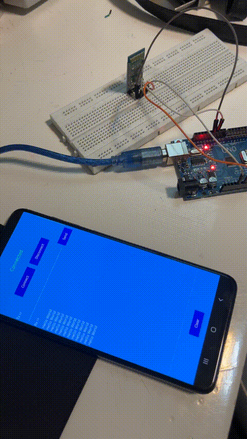
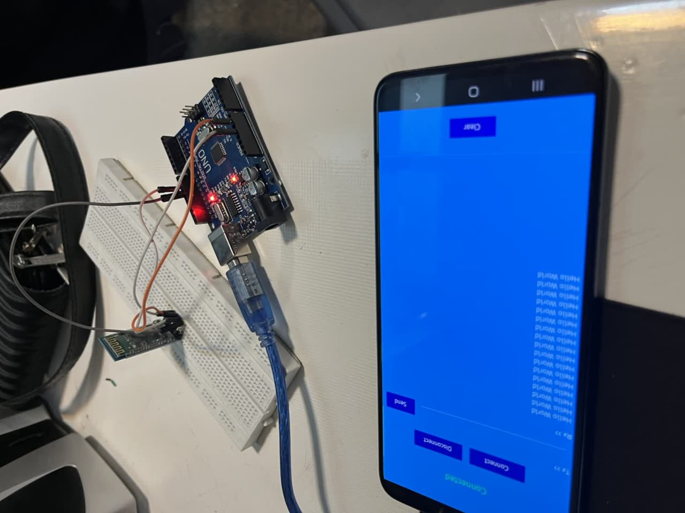

# bluetooth
🧪 گزارش‌کار آزمایش بلوتوث 

ازمایش: بلوتوث

🎯 هدف آزمایش:

هدف این آزمایش، تست و بررسی عملکرد ماژول بلوتوث در ارتباط با برد آردوینو است. در این پروژه، آردوینو طوری برنامه‌ریزی شده که به صورت خودکار یک پیام متنی (Hello World) را از طریق بلوتوث به دستگاه گیرنده مانند موبایل ارسال کند. این آزمایش مقدمه‌ای برای درک چگونگی برقراری ارتباط بی‌سیم بین آردوینو و دیگر دستگاه‌هاست.

🔍 شرح آزمایش:

در این آزمایش از یک ماژول بلوتوث مانند HC-05 یا HC-06 استفاده می‌کنیم که از طریق دو پین دیجیتال به آردوینو متصل شده است. ارتباط بین ماژول بلوتوث و آردوینو با استفاده از کتابخانه‌ی ارتباط سریال نرم‌افزاری (SoftwareSerial) برقرار می‌شود.

پس از برقراری اتصال، ماژول بلوتوث منتظر دریافت دستورات از آردوینو خواهد بود. آردوینو نیز در بازه‌های زمانی مشخص، یک پیام متنی را برای ارسال آماده می‌کند. این پیام از طریق بلوتوث به تلفن همراه (با اپلیکیشن‌هایی مانند Serial Bluetooth Terminal) ارسال می‌شود و کاربر می‌تواند پیام‌ها را در گوشی مشاهده کند. 📲

🧰 وسایل مورد نیاز:

آردوینو (Uno یا Nano) 🟦

ماژول بلوتوث HC-05 یا HC-06 📡

چند عدد سیم جامپر برای اتصال 🔌

کابل USB جهت تغذیه و برنامه‌ریزی آردوینو ⚡

تلفن همراه یا لپ‌تاپ با بلوتوث فعال 📱💻

نرم‌افزار دریافت داده بلوتوث (مانند Serial Bluetooth Terminal) 🛠️

✅ نتیجه‌گیری:

در این آزمایش توانستیم با موفقیت داده‌ای ساده را از طریق ماژول بلوتوث به دستگاه گیرنده ارسال کنیم. این ارتباط بی‌سیم نشان می‌دهد که چگونه می‌توان از ماژول‌های بلوتوث در پروژه‌های هوشمند برای ارسال اطلاعات، کنترل از راه دور و دریافت دستورات استفاده کرد. این آزمایش پایه‌ای برای پروژه‌های پیشرفته‌تر مانند کنترل ربات با گوشی، پایش دما و رطوبت از راه دور و... محسوب می‌شود. 🚀

