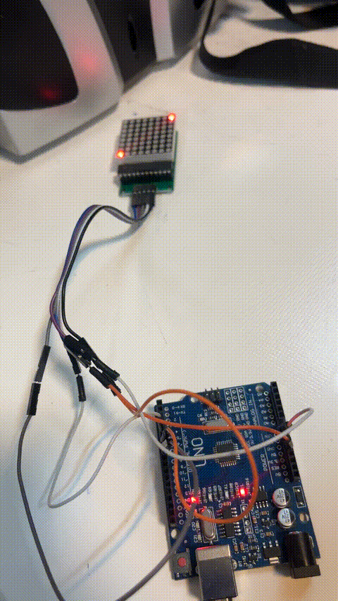
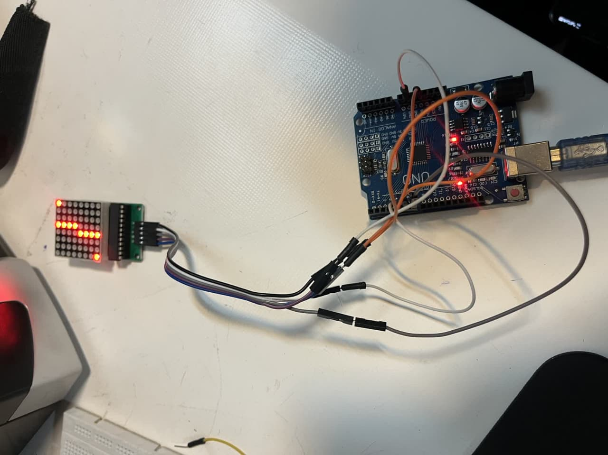

# dot-matrix

🧪 گزارش‌کار آزمایش ماتریس LED 8x8 با تراشه MAX7219

ازمایش:دات ماتریکس

🎯 هدف آزمایش:

هدف این آزمایش، راه‌اندازی یک ماژول ماتریس LED 8x8 با استفاده از تراشه MAX7219 و کنترل نمایش الگوهای ساده بر روی آن است. این آزمایش به ما یاد می‌دهد چطور با ارسال بیت‌های کنترلی از آردوینو، ال‌ای‌دی‌های ماتریسی را روشن و خاموش کنیم.

🔍 شرح آزمایش:

در این آزمایش، یک ماژول ماتریس LED با تراشه‌ی MAX7219 به آردوینو متصل شده است. این تراشه به ما این امکان را می‌دهد که بدون نیاز به سیم‌کشی پیچیده، تنها با استفاده از سه پین دیجیتال (DIN, CLK, CS) ماتریس را کنترل کنیم. 🔌

پس از راه‌اندازی، ابتدا یک LED در گوشه‌ی پایین-چپ روشن می‌شود، سپس یک LED دیگر در بالا-راست روشن می‌گردد. در ادامه دو ستون از ماتریس با الگوهای خاص روشن می‌شوند و سپس با دستور پاک‌سازی (clear)، تمام ال‌ای‌دی‌ها خاموش می‌شوند. این نمایش با تأخیر بین مراحل انجام می‌شود تا تغییرات قابل مشاهده باشد. 💡

🧰 وسایل مورد نیاز:

آردوینو (Uno یا مشابه) 🟦

ماژول ماتریس LED 8x8 با تراشه MAX7219 🔲

چند سیم جامپر برای اتصال 🧵

کابل USB برای تغذیه آردوینو ⚡

منبع تغذیه (در صورت نیاز برای چند ماژول) 🔋

✅ نتیجه‌گیری:

در این آزمایش با موفقیت توانستیم پیکسل‌های خاصی از ماتریس LED را کنترل کرده و الگوهای ساده‌ای نمایش دهیم. این تجربه پایه‌ای برای ساخت پروژه‌هایی مثل نمایشگر متنی اسکرول‌شونده، ساعت دیجیتال، اعلان وضعیت، افکت‌های گرافیکی و حتی بازی‌های ساده است. 🕹️
