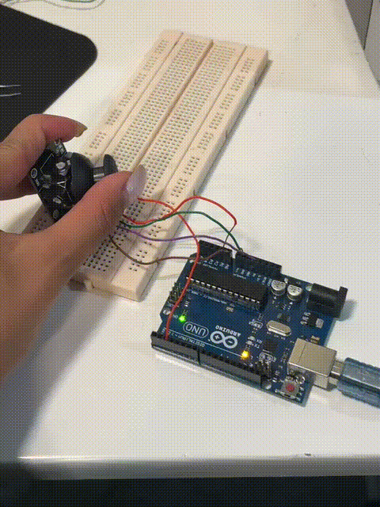

## گزارش کار پروژه خواندن اطلاعات جوی‌استیک و کنترل LED با آردوینو

**مقدمه:**

این گزارش، مراحل انجام پروژه خواندن اطلاعات یک جوی‌استیک آنالوگ (شامل وضعیت دکمه و موقعیت محورهای X و Y) و استفاده از مقدار محور Y برای کنترل شدت نور یک LED را شرح می‌دهد. هدف از این پروژه، آشنایی با نحوه استفاده از ورودی‌های آنالوگ و دیجیتال آردوینو و همچنین کنترل PWM برای تنظیم نور LED است.

**مواد و تجهیزات مورد نیاز:**

*   برد آردوینو (مانند Arduino Uno)
*   جوی‌استیک آنالوگ
*   LED
*   مقاومت (حدود 220 اهم برای LED)
*   سیم‌های اتصال
*   برد بورد (اختیاری)

**شرح پروژه:**

در این پروژه، از پین‌های آنالوگ A0 و A1 برای خواندن مقادیر محورهای X و Y جوی‌استیک و از پین دیجیتال 8 برای خواندن وضعیت دکمه‌ی جوی‌استیک استفاده می‌شود. مقدار خوانده شده از محور Y برای کنترل شدت نور LED متصل به پین دیجیتال 10 (که قابلیت PWM دارد) استفاده می‌شود.

**کد برنامه:**

```cpp
const int SW_pin = 8; // پین دیجیتال متصل به خروجی دکمه
const int X_pin = 0; // پین آنالوگ متصل به خروجی محور X
const int Y_pin = 1; // پین آنالوگ متصل به خروجی محور Y
int led = 10; // پین دیجیتال متصل به LED (دارای PWM)

void setup() {
  pinMode(SW_pin, INPUT);
  digitalWrite(SW_pin, HIGH); // فعال کردن مقاومت pull-up داخلی
  Serial.begin(9600);
  pinMode(led, OUTPUT);
}

void loop() {
  Serial.print("Switch:  ");
  Serial.print(digitalRead(SW_pin));
  Serial.print(" | ");
  Serial.print("X-axis: ");
  Serial.print(analogRead(X_pin));
  Serial.print(" | ");
  Serial.print("Y-axis: ");
  int a = analogRead(Y_pin);
  Serial.print(a);
  analogWrite(led, a / 4); // تنظیم شدت نور LED با مقدار محور Y (تقسیم بر 4 برای محدود کردن مقدار به 0-255)
  Serial.println(" | ");

  delay(200);
}
```

**شرح کد:**

*   `const int SW_pin = 8;`: تعریف پین دیجیتال 8 برای دکمه جوی‌استیک.
*   `const int X_pin = 0;`: تعریف پین آنالوگ A0 برای محور X.
*   `const int Y_pin = 1;`: تعریف پین آنالوگ A1 برای محور Y.
*   `int led = 10;`: تعریف پین دیجیتال 10 برای LED (دارای PWM).
*   `pinMode(SW_pin, INPUT);`: تنظیم پین دکمه به عنوان ورودی.
*   `digitalWrite(SW_pin, HIGH);`: فعال کردن مقاومت pull-up داخلی برای پین دکمه. این کار از خواندن مقادیر شناور جلوگیری می‌کند.
*   `Serial.begin(9600);`: شروع ارتباط سریال با نرخ 9600 برای نمایش اطلاعات در Serial Monitor.
*   `pinMode(led, OUTPUT);`: تنظیم پین LED به عنوان خروجی.
*   `analogRead(X_pin)` و `analogRead(Y_pin)`: خواندن مقادیر آنالوگ از محورهای X و Y (مقادیر بین 0 تا 1023).
*   `digitalRead(SW_pin)`: خواندن وضعیت دکمه (HIGH یا LOW).
*   `analogWrite(led, a / 4);`: تنظیم شدت نور LED با استفاده از PWM. مقدار `a` (مقدار خوانده شده از محور Y) بر 4 تقسیم می‌شود تا مقدار آن در محدوده 0-255 (محدوده PWM) قرار بگیرد.
*   `delay(200);`: تأخیر 200 میلی‌ثانیه برای جلوگیری از خواندن بیش از حد سریع اطلاعات.

**اتصالات سخت‌افزاری:**

*   پین VCC جوی‌استیک به پین 5V آردوینو.
*   پین GND جوی‌استیک به پین GND آردوینو.
*   پین VRx جوی‌استیک به پین A0 آردوینو.
*   پین VRy جوی‌استیک به پین A1 آردوینو.
*   پین SW جوی‌استیک به پین 8 آردوینو.
*   پین آند LED (پایه بلندتر) به یک مقاومت 220 اهم و سپس به پین 10 آردوینو.
*   پین کاتد LED (پایه کوتاه‌تر) به پین GND آردوینو.

**مراحل اجرا:**

1.  اتصالات سخت‌افزاری را طبق توضیحات بالا برقرار کنید.
2.  کد برنامه را در نرم‌افزار Arduino IDE باز کنید.
3.  برد آردوینو را به کامپیوتر متصل کنید.
4.  برد و پورت سریال مربوط به آردوینو را در Arduino IDE انتخاب کنید.
5.  کد را روی برد آردوینو آپلود کنید.
6.  Serial Monitor را در Arduino IDE باز کنید.
7.  با حرکت دادن جوی‌استیک، مقادیر محورهای X و Y و وضعیت دکمه را در Serial Monitor مشاهده خواهید کرد. همچنین، با تغییر موقعیت محور Y، شدت نور LED تغییر خواهد کرد.

**تصاویر:**



**نتیجه‌گیری:**

این پروژه با موفقیت نشان داد که چگونه می‌توان اطلاعات یک جوی‌استیک آنالوگ را خواند و از آن برای کنترل خروجی‌های دیگر مانند LED استفاده کرد. این روش می‌تواند در پروژه‌های مختلفی مانند کنترل ربات، بازی‌ها و رابط‌های کاربری مورد استفاده قرار گیرد.

