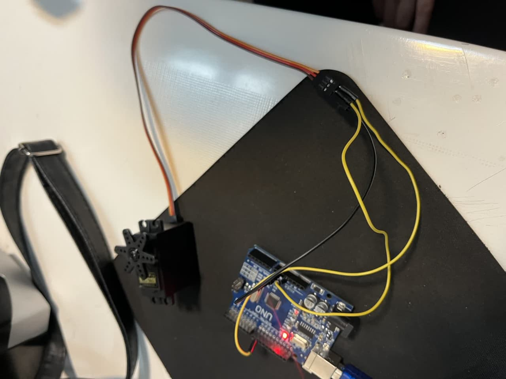
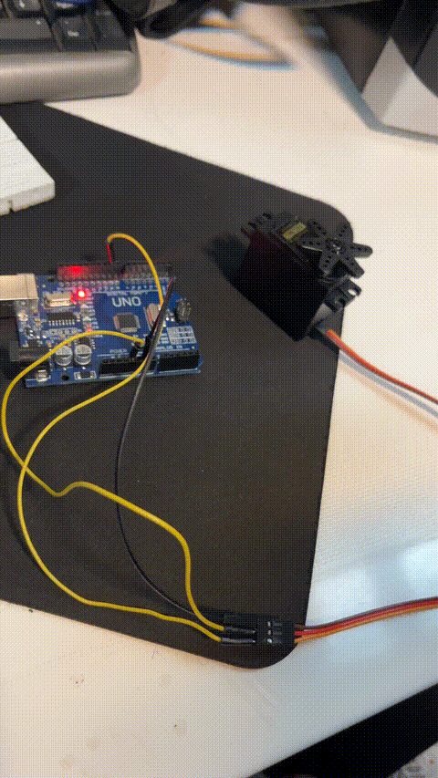

# servoo
🧪 گزارش‌کار آزمایش سروو موتور 

ازمایش: servo

🎯 هدف آزمایش:

هدف این آزمایش، بررسی نحوه‌ی کنترل و حرکت یک سروو موتور توسط برد آردوینو است. در این پروژه می‌خواهیم سروو را به زوایای مختلف بچرخانیم و با نحوه‌ی ارسال دستورات کنترلی به آن آشنا شویم.

🔍 شرح آزمایش:

در این آزمایش، از یک سروو موتور استفاده می‌کنیم که به پین دیجیتال آردوینو متصل شده است. با استفاده از کتابخانه‌ی مخصوص سروو (Servo.h) امکان ارسال زاویه‌ی دقیق برای چرخش فراهم می‌شود. 📐

موتور سروو پس از روشن شدن، به ترتیب به زوایای 0، 45، 90، 135 و 180 درجه حرکت می‌کند، سپس همان مسیر را به صورت معکوس طی کرده و به موقعیت اولیه بازمی‌گردد. هر تغییر زاویه با یک تأخیر ۱ ثانیه‌ای همراه است تا حرکت به صورت واضح دیده شود. 🔄

🧰 وسایل مورد نیاز:

برد آردوینو (Uno یا مشابه) 🟦

سروو موتور استاندارد (مثل SG90) ⚙️

سیم جامپر برای اتصال 🔌

کابل USB برای تغذیه آردوینو ⚡

منبع تغذیه مناسب در صورت نیاز (برای سرووهای قوی‌تر) 🔋

✅ نتیجه‌گیری:

در این آزمایش، سروو موتور با موفقیت به زوایای مختلف حرکت کرد و سپس به موقعیت اولیه بازگشت. این عملکرد نشان می‌دهد که آردوینو توانایی کنترل دقیق زاویه‌ی چرخش را دارد. از این قابلیت می‌توان در پروژه‌هایی مانند باز و بسته شدن درب، بازوی رباتیک، سیستم‌های تنظیم موقعیت و کنترل مکانیکی استفاده کرد. 🤖

