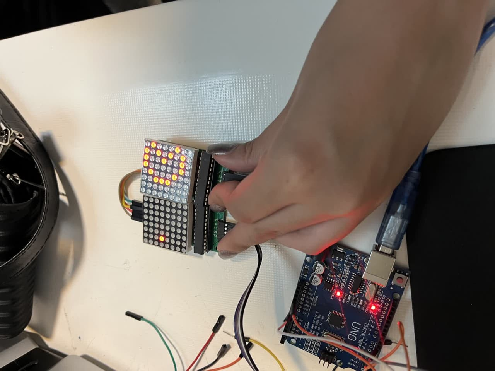

# two-matrix

گزارش‌کار آزمایش: اتصال آبشاری دو ماتریس LED و حرکت شکل روی آن

ازمایش:اتصال دو ماتریکس

هدف آزمایش:

آشنایی با نحوه‌ی اتصال دو ماژول ماتریس LED 8x8 به صورت آبشاری و نمایش یک شکل (پک‌من) که از ماژول اول وارد شده و به سمت راست، روی ماژول دوم حرکت می‌کند.

⸻

وسایل مورد نیاز:

 • ۲ عدد ماژول ماتریس LED 8x8 با تراشه MAX7219
 
 • آردوینو UNO یا NANO
 
 • سیم جامپر
 
 • کابل USB
 
 • کامپیوتر یا لپ‌تاپ با Arduino IDE

⸻

شرح آزمایش:

در این آزمایش، دو ماژول ماتریس 8x8 به صورت پشت‌سرهم (آبشاری) به هم متصل شده‌اند. به این ترتیب، هر دو ماتریس با یک مجموعه سیم مشترک از آردوینو فرمان می‌گیرند و به صورت یک نمایشگر پیوسته 16x8 عمل می‌کنند.

در برنامه:

 • تعداد ماتریس‌ها با مقدار maxInUse = 2 مشخص شده.
 
 • یک شکل پک‌من با استفاده از آرایه باینری تعریف شده.
 
 • شکل روی ماتریس سمت چپ (اول) ظاهر می‌شود.
 
 • با استفاده از shiftRight()، شکل به‌تدریج به سمت راست حرکت می‌کند و وارد ماتریس دوم می‌شود.
 
 • پس از کامل شدن حرکت، ماتریس پاک می‌شود.
 

این روش اتصال، به ما اجازه می‌ده شکل‌ها یا نوشته‌های طولانی‌تر رو نمایش بدیم، مثلاً برای ساخت تابلوی روان.

⸻

نتیجه‌گیری:

در این پروژه یاد گرفتیم که چطور می‌شه چندین ماژول ماتریس رو به صورت زنجیره‌ای به هم وصل کرد و یک فضای نمایشی گسترده‌تر ایجاد کرد.
استفاده از دستورات کتابخانه MaxMatrix بسیار ساده و مؤثره و بدون نیاز به کدنویسی پیچیده، انیمیشن‌های روان ایجاد می‌شه.
